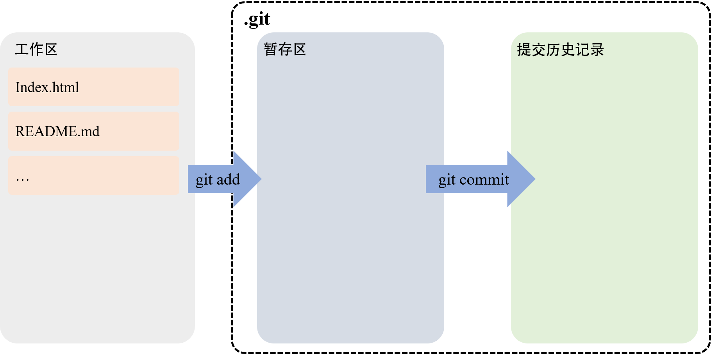
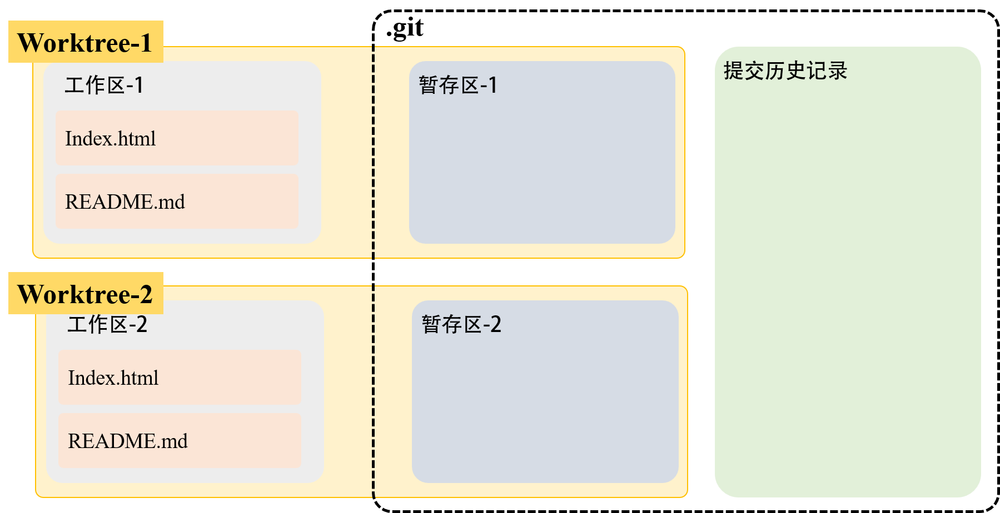

# Git笔记

---
## git 安装
~~~shell
Windows     :https://git-scm.com/install/windows
linux       :https://git-scm.com/install/linux
Mac         :https://git-scm.com/install/mac
~~~

## git 文件操作
~~~shell
git -v              : 查看版本
git init            : git初始化
git status          : git状态
git log             : git记录（--online）

git add                 : 修改放在暂存区
git commit -m ""        : 修改正式提交（-m:说明）

git diff                        : 查看修改

git restore <file>              : 回滚（工作区）
git restore .                   : 回滚所有改动（工作区）

git restore --staged <file>     : 回滚（暂存区）——> 仅修改暂存区
git restore --staged .          : 回滚所有改动（暂存区）

git reset --hard HEAD~1         : 回滚（提交历史）——> 所有区
git reset --mixed HEAD~1        : 回滚（提交历史）——> 暂存&提交历史
git reset --soft HEAD~1         : 回滚（提交历史）——> 提交历史

git revert HEAD                 : 回滚（"反向变更"的提交）

# 配置个人信息
git config --global user.name "***"
git config --global user.email "***"

# git忽略（不被git跟踪）
创建 .gitignore 文件  ——>  将<不被跟踪的文件名称>写在这个文件里面
~~~

## git 分支操作
~~~shell
git branch                  : 列出所有分支

git branch <name>           : 创建分支
git switch <name>           : 切换分支
git switch -c <name>        : 创建并切换分支
git checkout -b <name>      : 创建并切换分支(旧)

git merge <name>            : 合并分支(先切换回主分支)
git branch -d <name>        : 删除分支

# 合并冲突：
1. 手动修改并重新提交
2. rebase(移动分支到最新的master分支)
    git rebase master           : 移动分支到最新的master(先切换分支)
    git rebase --continue       : 在rebase时的提交

# stash（适合临时打断的情况）
git stash                   : 先把工作区的改动藏起来（不提交）-> 半成品
git stash pop               : 半成品弹出来

#  worktree
git worktree add -b <分支> <目录> master
git config --global core.quotePath false
git worktree list
~~~

## git 上传(GitHub)
~~~shell
# SSH key(私钥 & 公钥)
ssh-keygen -t ed25519 -C "<email>"      : 生成密钥
cat <.pub>                              : 显示公钥
# 公钥粘贴到 GitHub 的 SSH 配置页面

git remote add <name> <仓库地址>        : 记住远程仓库并命名
git branch -M main                      : 改主分支名称
git push -u <仓库>                      : 推送到github

git clone <仓库地址> <name>             : 代码拉取到本地
~~~

## 参考资料
~~~shell
[1] https://git-scm.com/learn
[2] https://www.runoob.com/git/git-tutorial.html
[3] https://www.bilibili.com/video/BV1LwHv6LEYz/?trackid=web_pegasus_0.router-web-pegasus-2479516-gfll4.1791082931774.152&spm_id_from=333.1007.tianma.1-2-2.click&vd_source=bf277a9227419b48ff72bfbda3e621be
~~~

